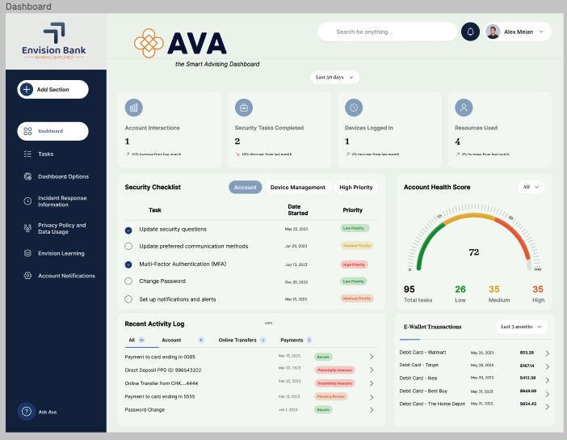
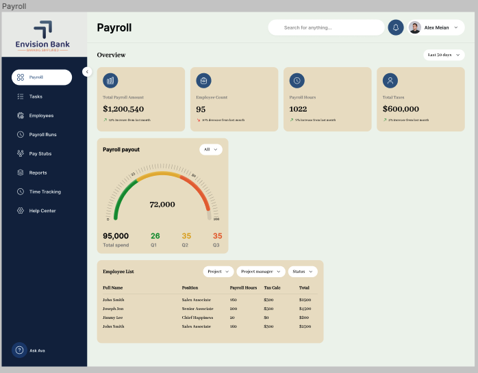
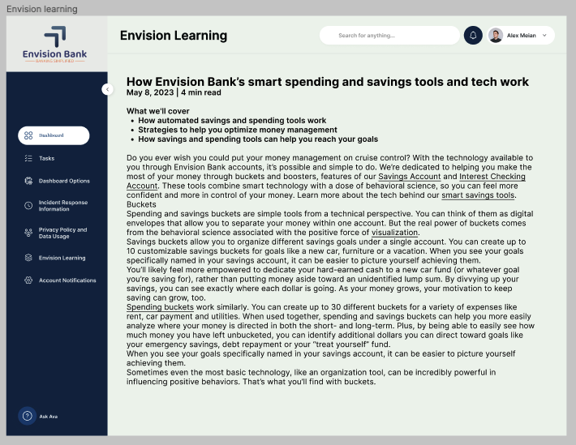

## Envision Bank Smart Spending & Savings Dashboard

This folder contains designs I created for Envision Bank's smart spending and savings dashboard and marine UI as part of the Capgemini RISE program. Envision Bank was looking to improve their digital offerings to help customers better manage their money and reach their financial goals.

### Dashboard
The dashboard design provides a consolidated view of key account information, security tasks, connected devices, recent transactions and an overall account health score.

### Payroll
The payroll screen gives a clear breakdown of payroll amounts and allocations.

### How it Works
An article explains how Envision Bank's smart spending and savings tools function.

These designs aim to provide simple yet powerful tools to help Envision Bank's customers visualize their financial picture and make smart money moves. By enabling customers to easily see their full financial situation and access helpful savings and spending insights, Envision Bank can deliver more value, boost engagement and customer loyalty, and regain market share in an increasingly competitive banking landscape.

Figma Project
The full Figma design project can be viewed here:
Envision Bank Dashboard Figma Project
[Figma link](https://www.figma.com/file/ExjzBjPPom5DGM8NHozF5Q/Envision-Bank-Dashboard?type=design&node-id=0%3A1&mode=design&t=CgqpVFZuKfbJ86dx-1)