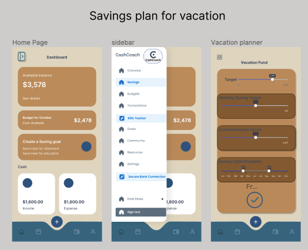
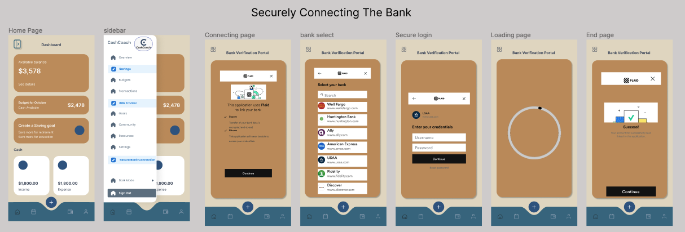
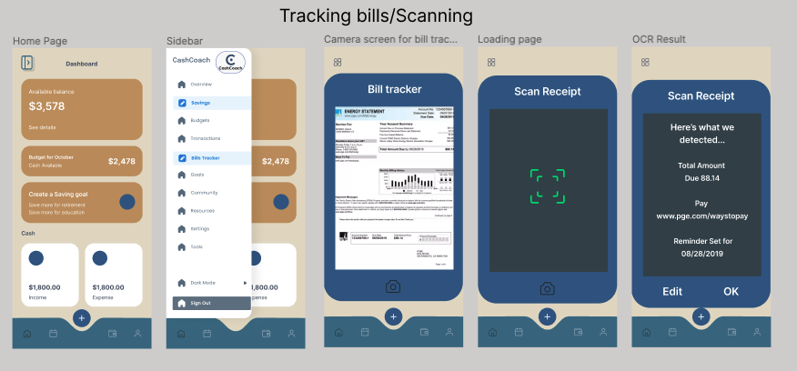
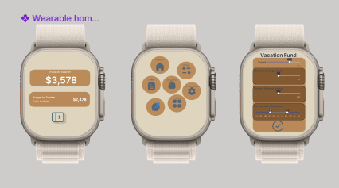
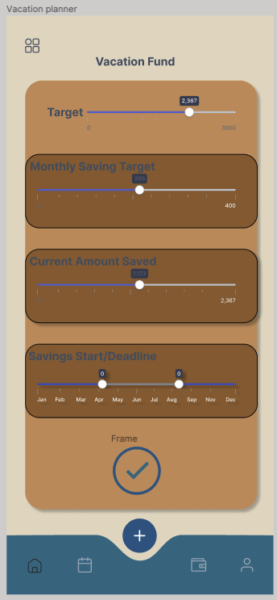

# Envision Bank Budgeting & Savings App

This project contains UI designs I created for Envision Bank's budgeting and savings mobile app. The goal was to create an intuitive app that helps users easily track spending, save towards goals, and improve their overall financial health.

## Features

### Home Page
The home page provides a quick snapshot of the user's financial picture:
- Current available balance and total in checking/savings 
- Shortcuts to view budget, create a savings goal, and securely connect accounts
- Cash and credit card transaction history
- Savings plan recommendations based on spending habits

### Secure Account Linking
Users can securely link their accounts from other banks to get a consolidated financial view:
- Utilizes industry-standard bank data APIs for read-only access
- Multi-factor authentication ensures only authorized devices can connect
- Data encrypted in transit and at rest

 

### Bill Tracking & Receipt Scanning
The app enables easy expense and bill management:
- Bill tracker shows upcoming and past due bills 
- Receipt scanner extracts key data and matches it to transactions
- Bill payment reminders and alerts to avoid late fees

### Bank Connection
Step-by-step process to securely connect bank accounts:
- Verify identity with bank login credentials 
- Select specific accounts to link
- Customize sync frequency and permissions
- Review connection details before authorizing

### Savings Goals & Vacation Fund
Users can define personalized savings goals and track progress:
- Set target amount and deadline for goals like a vacation fund
- Smart recommendations for monthly savings targets
- Visuals show progress and projected goal completion date
- Easy one-tap transfers from checking to savings

## Design Principles
- Clear information hierarchy and progressive disclosure 
- Contextual tips and explainers to help users navigate
- Consistent use of color to visually group related functions
- Emphasis on data security and privacy throughout the UX
- Mobile-first responsive layouts optimized for on-the-go use

The complete Figma project can be viewed here:
[Envision Bank Budgeting App Figma Project](https://www.figma.com/file/Fgy8eqVM73JnEc8d1ToFWT/Budgeting-app?type=design&node-id=0%3A1&mode=design&t=G6LSAxluyu3iCHpA-1)

This app aims to be a one-stop-shop for users to gain clarity on their complete financial picture and develop healthy money habits. By combining smart budgeting tools, expense tracking, savings goals and bank integrations into one cohesive experience, Envision Bank can empower users to take control of their financial life.