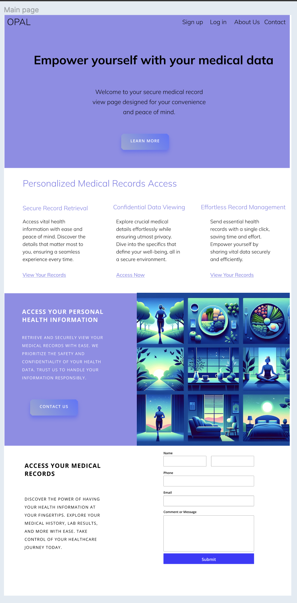
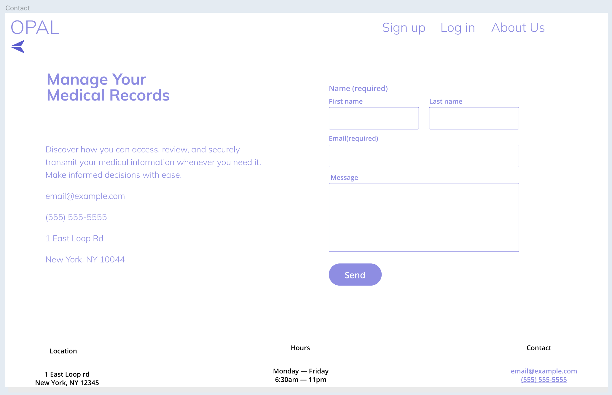
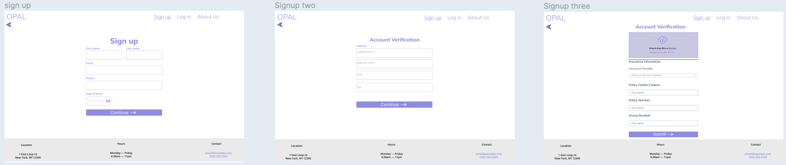
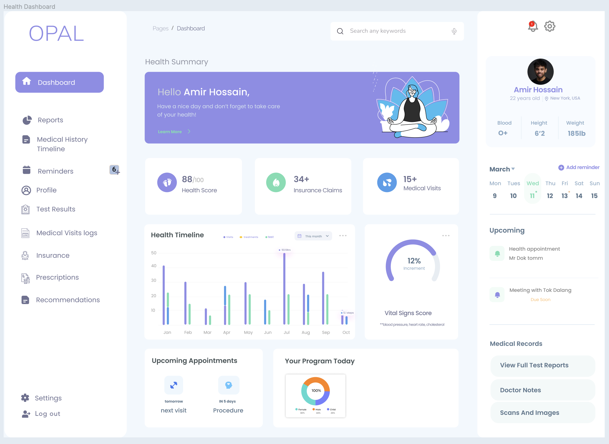
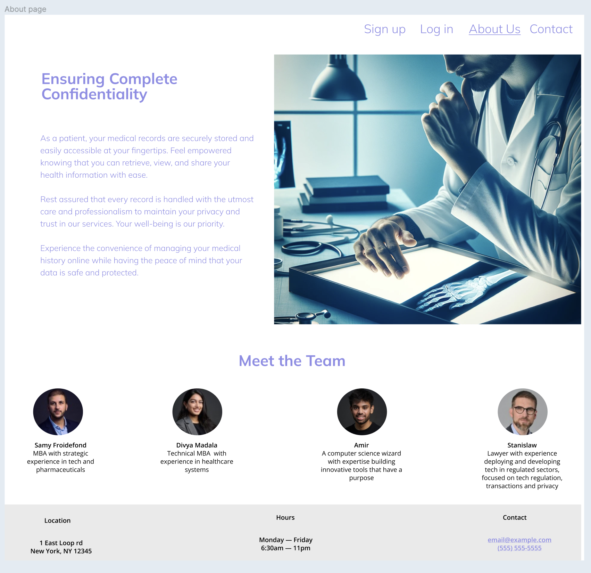

# OPAL Health Dashboard

This folder contains designs I created for OPAL, a centralized health app that aggregates medical records, insurance claims, doctor visits and more into one convenient place. OPAL aims to empower patients by giving them easy access and control over their health information.

## Pages

### Main Page

The main landing page provides an overview of OPAL's key features and benefits, with a prominent call-to-action to sign up or log in. The clean, modern design and soothing illustrations convey a sense of calm and trust.

### Contact Form 

Easily contact OPAL with questions or feedback via this simple form. Required fields ensure OPAL has the key information needed to respond.

### Sign Up Flow
 
The 3-step sign up process is quick and frictionless while gathering essential information. Account verification ensures security.

### Health Dashboard

The dashboard provides a comprehensive yet scannable overview of the user's key health metrics and upcoming appointments. Intuitive navigation enables users to dive into medical records, insurance, prescriptions and more. The warm greeting and profile picture personalize the experience.

### About Page

The About page highlights OPAL's mission to facilitate proactive, informed healthcare by consolidating data and leveraging predictive insights. Profiles of the diverse leadership team build trust and credibility.

## Design Approach
The designs utilize a soft, muted color palette and rounded elements to create a welcoming, humanistic feel. The information architecture and layout are carefully constructed to enable users to easily view and manage their health journey while maintaining privacy and security.

By storing health information securely in one centralized place and providing timely insights and recommendations, OPAL aims to help people live healthier lives and get the most from their healthcare experience. The user-centric design strives to make managing health feel empowering rather than overwhelming.

## Figma Project
View the full Figma design project here:
[OPAL Health Dashboard Figma Project](https://www.figma.com/file/TVqtbBkStTIYVSlybhqpgJ/Centralized-health-app?type=design&node-id=0%3A1&mode=design&t=E3t0jdPA7tVR2gQf-1)