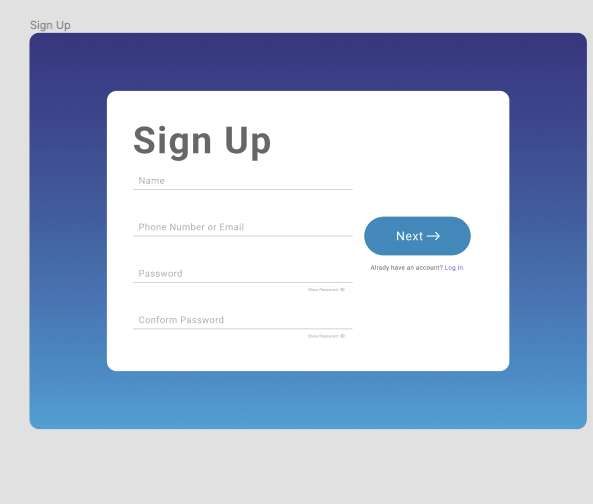
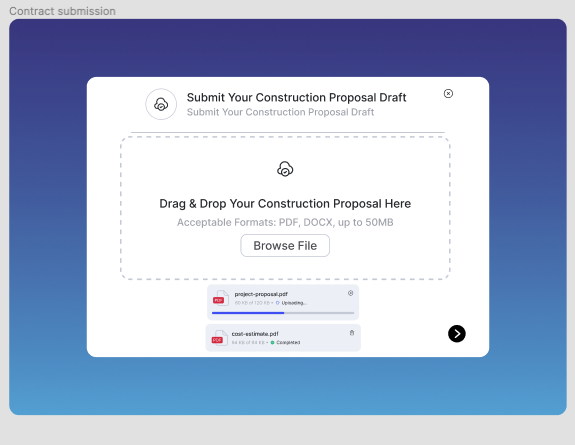
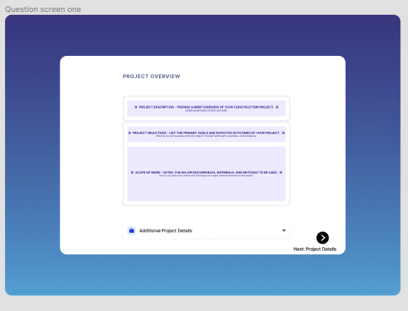
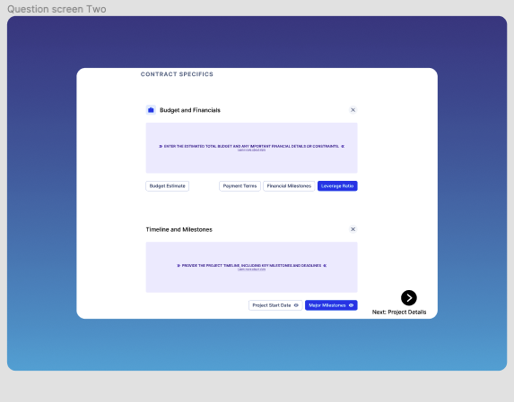
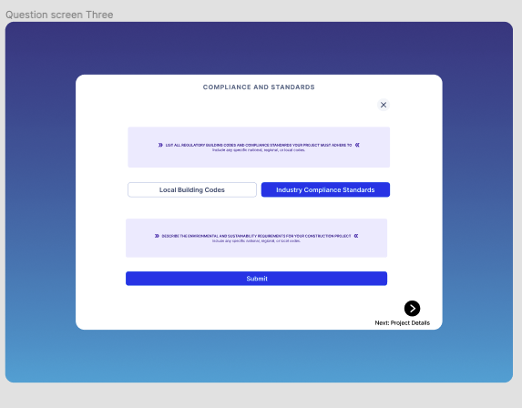

# Contract Procurement Review Service Onboarding

This Figma mockup shows the user onboarding flow for a contract procurement review service aimed at helping small businesses win contracts by submitting strong proposals. The service reviews and provides feedback on proposal contracts before submission.

## Sign Up Screen
The initial sign up screen allows the user to enter their name, phone, email and set a password to create an account.

 

## Contract Submission
After signing up, the user can submit their construction proposal draft by either uploading a file or using the built-in drag and drop interface.

## Compliance Questions  
A series of questions helps determine if the proposal meets key compliance and regulatory standards for construction contracts.

## Contract Specifics
The user provides additional contract details like budget, financials, timeline and milestones. This info helps tailor the expert review.

  

## Project Overview
An overview screen summarizes the key project and financial details the user has provided before finalizing the contract review submission.

This onboarding flow aims to make submitting contracts for review quick and frictionless while gathering the necessary info for an insightful expert evaluation that helps small construction firms win more business. Intuitive UX guides users through the process step-by-step.

View the full Figma mockup here:  
[Contract Review Service Onboarding](https://www.figma.com/file/m2nplY2UJfr2OgwgpclA9n/Start-up-studio-demo?type=design&node-id=0%3A1&mode=design&t=AdWPXsSO38kijVQD-1)
