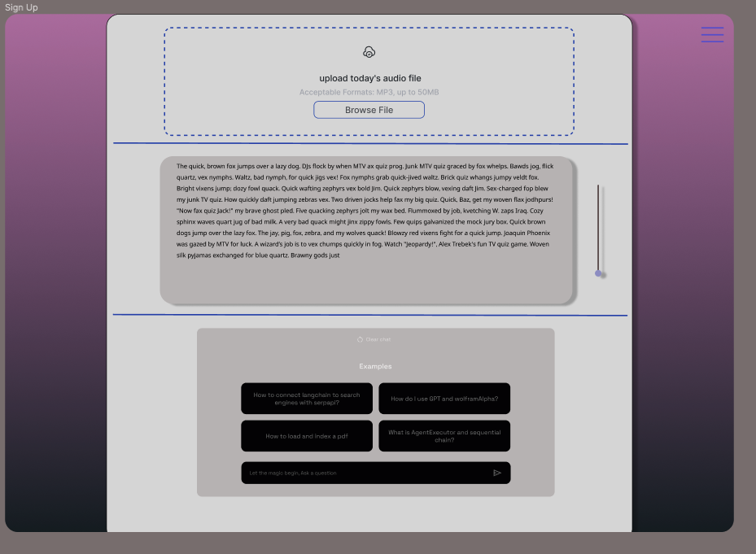
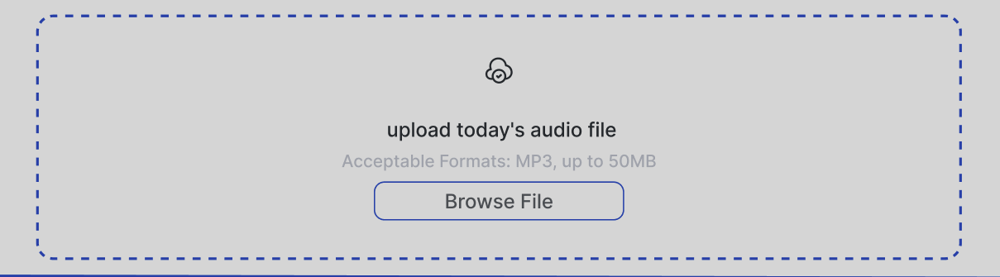
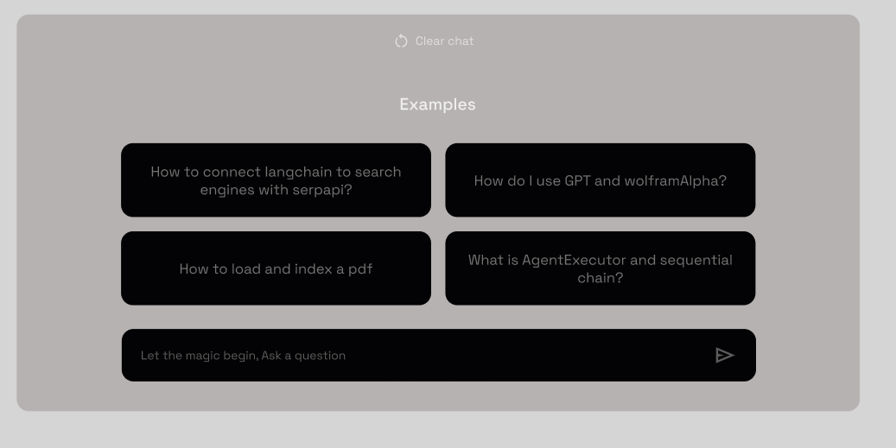

# Retrieval Augmented Generation Chatbot UI

This Figma project contains the user interface designs for a retrieval augmented generation chatbot that allows users to engage in conversational question answering with large documents.

## Chat Interface
The chat interface enables users to ask questions and receive answers based on the content of the uploaded documents. Key features include:

- Text input field for entering questions
- Scrollable message history displaying the conversation
- Document information panel showing the currently loaded documents

 

## Document Upload
Before using the chatbot, users need to upload the documents they want to chat with. The document upload screen provides:

- Drag-and-drop zone for adding document files
- List of uploaded documents
- Options to add more documents or proceed to the chat

## Settings & Help
The settings screen allows users to configure the chatbot's behavior and access additional help:

- Explanation of how the chatbot works under the hood 
- Options to tweak the generation settings
- FAQs and troubleshooting tips

This UI aims to provide an intuitive and seamless experience for users to interact with documents using natural language conversations. By enabling easy document upload, a clean chat interface, and options to tune the system's behavior, this interface empowers users to quickly extract insights and answers from their documents.

Figma Project Link: [Chatbot UI Figma Project](https://www.figma.com/file/P9Xss6wq9F7Kw8OGhikqVZ/Untitled?type=design&node-id=0%3A1&mode=design&t=mI3AOUbmORQjpA2J-1)