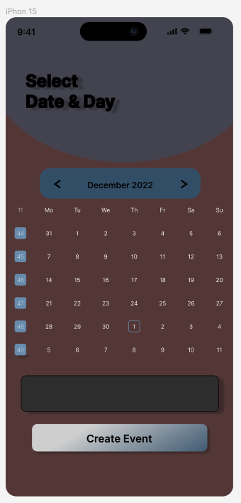
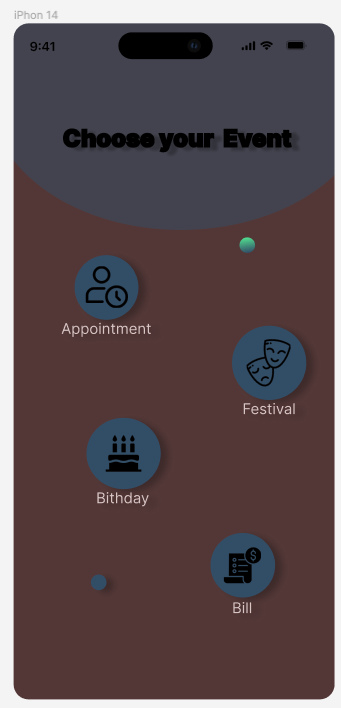
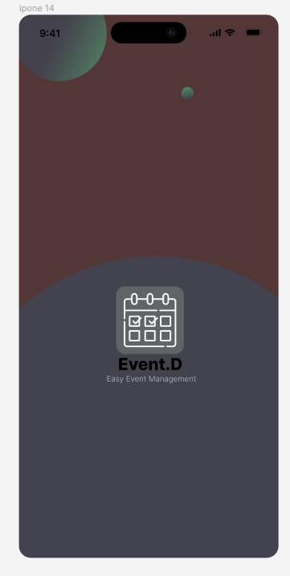

## Event.D - Event Management App
This folder contains UX/UI designs I created for Event.D, a mobile app to simplify managing events from a single platform. The app allows users to easily create, schedule and track various types of events.

### Select Date & Day Screen
Users begin by selecting the desired date for their event from an intuitive calendar view.

### Choose Your Event Screen
Users then choose the type of event they want to create from options like Appointment, Festival, Birthday or Bill Payment.

###  Event Details Screen
After selecting the event type, users can fill in all the relevant details like event name, time, location, description, etc.

The clean, streamlined interface enables users to efficiently input event information without any distractions or clutter. Visual icons for each event type make selection quick and easy.

By consolidating all their events into one simple app, Event.D saves users time and helps ensure no important date slips through the cracks, whether it's a critical work meeting, a loved one's birthday, or a bill due date. The app is designed to integrate with users' calendars and provide smart alerts to help them stay on top of their busy schedules.

## Figma Project
The full Figma design project with all screens and details can be viewed here:
[Event.D App Figma Project](https://www.figma.com/file/ksYwNviIfwV6RA6HzSofGD/Event-manager-(Community)?type=design&node-id=0%3A1&mode=design&t=LMBFIYDm1gSZVt9l-1)